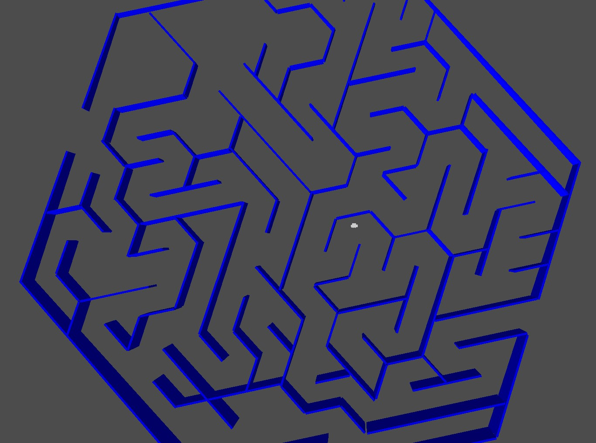
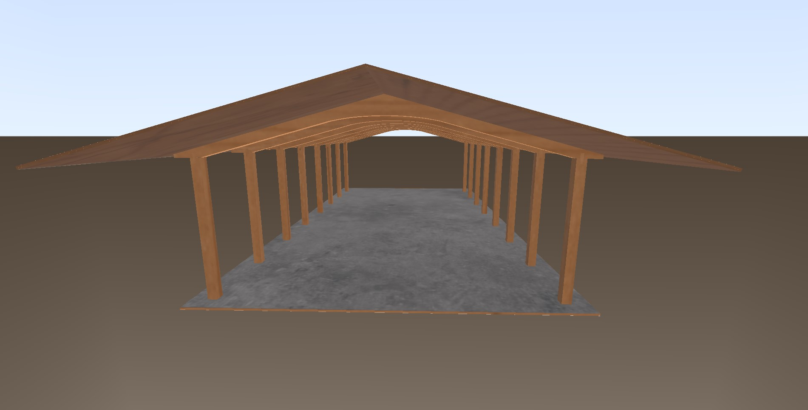
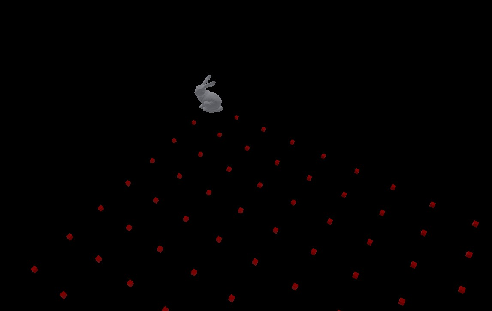
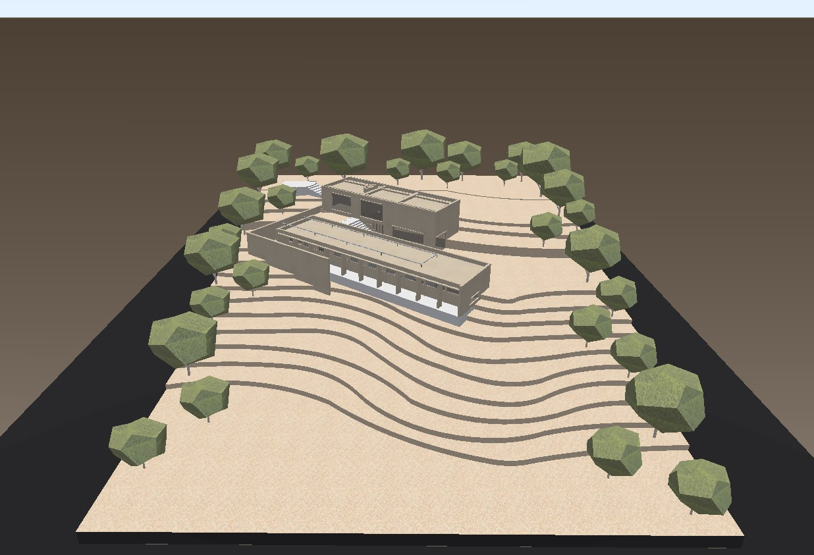
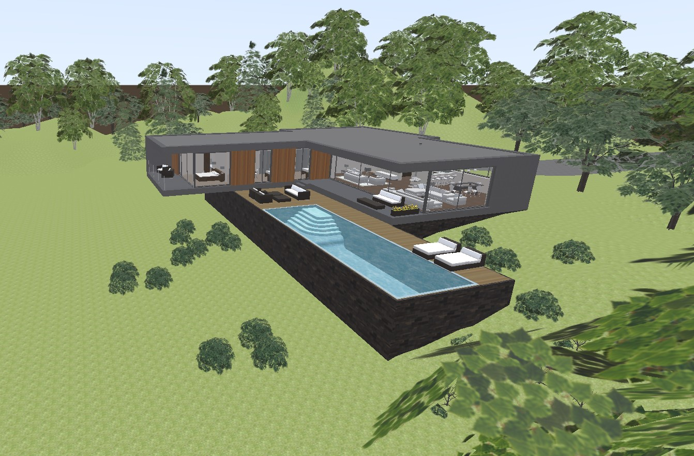
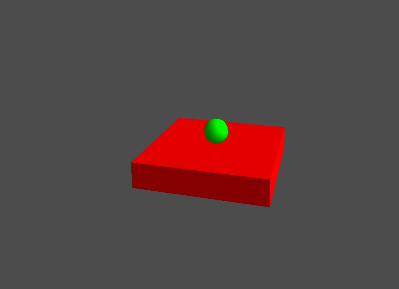

# Graficación Java

Este  proyecto fue creado con ayuda de la libreria [LibGDX](https://docs.expo.dev/get-started/installation/) libreria que gestiona las dependencias para utilizar OpenGL en Java

Para poder utilizar el proyecto es necesario tener instalado

* [Maven](https://maven.apache.org/install.html)

## Directorios

* **assets/** Directorio con los modelos .obj y gltf, este ultimo fue utilizado para las maquetas
* **core/** Dentro esta la logica para cada vista, en la parte de abajo se muestran cada una de estas clases

## Como correr

Es necesario que todas la librerias del build.gradle esten instaladas correctamente, recordatorio **Hacer clean and Build del proyecto**, una vez que el programa no marque error solo resta cambiar el nombre de la clase en **core** de la que se quiera correr en el directorio **/desktop** DesktopLauncher esta la clase main

 
    
Laberinto

    

 
    
Techado

    

 
    
Collision

    

 
    
Maqueta

    

 
    
Maqueta02

    

 
    
MyGdx

    

